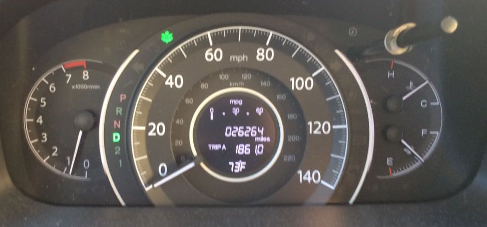
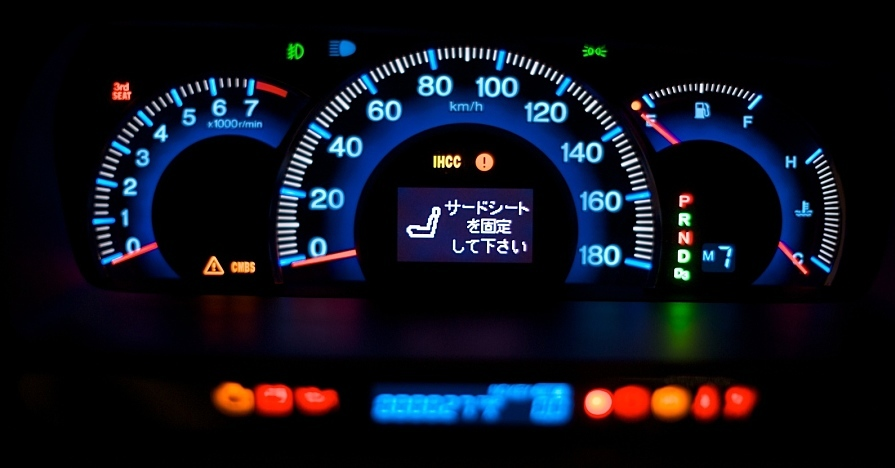
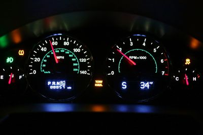
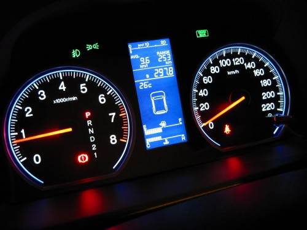
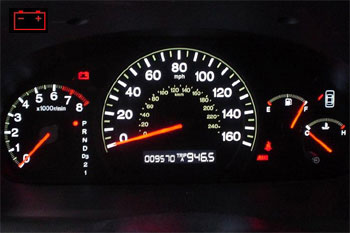
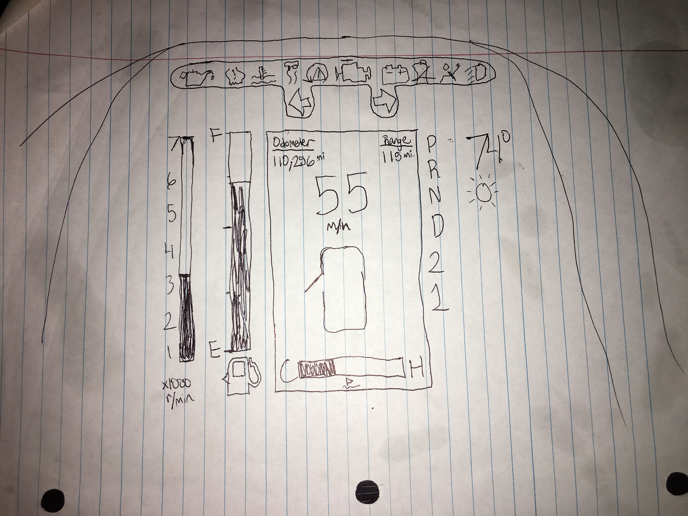

# p2JoelAnaghara
CS 4331 Project 2

### Dashboards ###

#### Pros v Cons ####
These dashboards make use of colorful lighting and red accents to make everything easy to see at night which is a must. The dashboards display what gear the car is currently in as well. Some might find it unnecessary and not all dashboards shown included this but I think it is important for the dashboard to have MPH as well as KM/H displayed.

Drawbacks of these designs is that they seem to be outdated. The speedometer and tachometer take up a huge amount of space when they only convey one information. A speedometer only needs to tell you how fast you are going and the tachometer only needs to tell you how fast your tires are spinning. Both information can be displayed numerically and not with a whole needle turning.

### Common Features ###
The most common areas of the dashboard have to be the emergency lights, speedometer, and fuel indicator. Other areas are also important, but most people don't pay much attention. For example, the tachometer is very much neccessary, but the common person doesn't care to pay much attention to how fast their tires are racing. Maybe in Nascar, or some professional racing, they rely heavily on watching the tachometer. Emergency lights are very important as they gives great user feedback and help keep everyone in the car safe. This area of the dashboard is something that should always be paid attention to. The most common lights are the turning signal lights or the car lights. Nowadays, the dashboard should be simple concise and digital. 

### My Design ###

